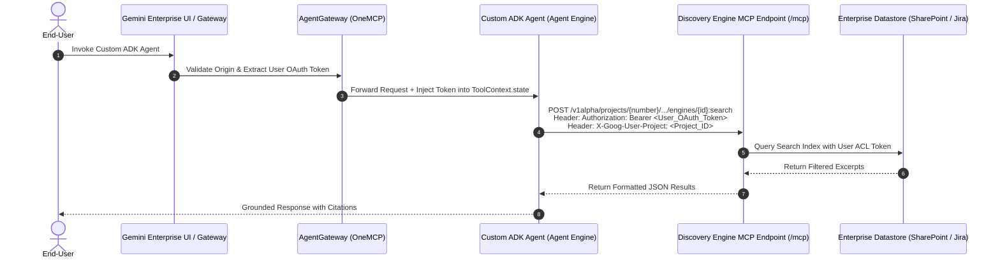

# 📄 Product Requirements Document (PRD)

# Native Data Connector Integration for Custom ADK Agents on Agent Engine

**Document ID**: PRD-ADK-GE-CONNECTOR-2026  
**Date**: January 29, 2026  
**Status**: Proposal for Leadership Strategy Review (Post-Next '26 Roadmap)  
**Target Release**: H2 2026 (Option 2: Integrated MCP Access)  

---

## 1. Summary

This Product Requirements Document (PRD) specifies the platform features required to close the **"No-Code Parity Gap"** in Gemini Enterprise (GE) and Vertex AI Agent Engine. It defines how pro-code **Agent Development Kit (ADK)** agents can natively discover, authenticate, and query Gemini Enterprise Data Connectors (**SharePoint, Atlassian Jira, Confluence, Google Drive, Salesforce, ServiceNow**) via direct MCP REST endpoints (`discoveryengine.googleapis.com/mcp`) while dynamically propagating end-user OAuth access tokens to preserve native Access Control Lists (ACLs).

---

## 2. Contacts & Stakeholders

| Stakeholder Role | Name / Group | Focus / Priority |
| :--- | :--- | :--- |
| **Product Lead / Author** | AI Applied Engineering & TDL Team | Architectural specification & reference POC |
| **GE Leadership** | Dev Tagare, Maryam Gholami | Strategic roadmap alignment & staffing approval |
| **Agent Builder PMs** | Anusheel Pareek, Pramodh Ramesh | Connector registry & platform integration |
| **Agent Engine / Platform PMs** | Michael Vakoc, Mike Clark | AgentGateway, OneMCP, and ADK SDK parity |
| **Key Customer Accounts** | Okta, Woolworths, McDonald’s, GeoTab | Unblocking custom ADK enterprise agent deployments |

---

## 3. Background & Problem Statement

### 3.1 Context & "The No-Code Parity Gap"
Currently, enterprise customers face a severe feature degradation when graduating from No-Code agent builders to Pro-Code ADK implementations on Agent Engine:

- **No-Code Agents (GE Agent Designer)**: Can fully utilize out-of-the-box GE Data Connectors with deep search indexing and automatic permission handling.
- **Custom Pro-Code ADK Agents**: **Cannot access these connectors**. Developers must fall back to standard APIs, Application Integration connectors, or custom MCP servers.

### 3.2 Key Customer Impact
1. **Okta**: Built a Jira+Confluence workflow agent. When graduating to ADK, they failed to reproduce the answer quality and polish of Gemini Enterprise due to `VertexAiSearchTool` limitations.
2. **Woolworths**: Blocked from building a custom ADK agent for Jira workflows because standard Jira APIs lack the required search indexing capability offered by the GE Jira Connector.
3. **McDonald's & GeoTab**: Explicitly requested that GE Data Connectors be accessible to custom ADK agents outside the No-Code UI.

### 3.3 Known Product & Technical Blockers
- **GCP Issue #434712760 (The Connector Wall)**: No-code data connectors are not inherited by ADK agents on Agent Engine.
- **GCP Issue #897 / #483989453 (`VertexAiSearchTool` Limitations)**: Built-in `VertexAiSearchTool` defaults to Service Account (ADC) credentials, returning empty metadata or bypassing user-level permissions on SharePoint/Jira datastores.

---

## 4. Objectives & Key Results (OKRs)

### Objective
Enable custom ADK agents running on Agent Engine to query Gemini Enterprise connected datastores natively as MCP tools with zero loss of document permission context.

### Key Results (SMART OKRs)
- **KR1**: Reduce customer migration failure rate when graduating from No-Code Agent Designer to ADK from **>40% to <5%**.
- **KR2**: Unblock **$50M+ ARR** in delayed enterprise contracts across Tier-1 accounts (Okta, Woolworths, McDonald's).
- **KR3**: Achieve **100% answer quality parity** between No-Code and ADK Pro-Code agents over SharePoint and Jira datastores.
- **KR4**: Maintain **<50ms overhead** for user identity token propagation through `AgentGateway`.

---

## 5. Target Market & User Segments

### Target Persona
**Enterprise AI Developers & Forward-Deployed Engineers (FDEs)** building multi-step, multi-tool agents in Python/TypeScript using Google ADK on Vertex AI Agent Engine.

### Constraints & Jobs-To-Be-Done (JTBD)
- **JTBD**: *"When I convert a No-Code agent to a custom ADK agent, I want to keep using the enterprise SharePoint and Jira connectors so that my agent preserves document search polish and respects user permissions without requiring me to write custom MCP servers."*
- **Constraint**: Must comply with strict enterprise data governance (ISO 27001, SOC2) — **User A must never see User B's documents**.

---

## 6. Value Proposition

| Customer Pain Avoided | Gain Delivered | Competitor Differentiation |
| :--- | :--- | :--- |
| Writing custom MCP servers or buying 3rd-party CData licenses. | Out-of-the-box MCP REST tool endpoints (`discoveryengine.googleapis.com/mcp`). | Native, zero-maintenance identity-aware connector access. |
| Security compliance breaches from service account ACL bypass. | Dynamic user OAuth access token propagation via `ToolContext.state`. | Granular user-level ACL enforcement directly in search index. |
| Degraded search answer quality in ADK code. | High-precision RAG search with automated AlphaEvolve snippet reranking. | Superior search polish powered by Gemini Enterprise indexing. |

---

## 7. Technical Solution & Specification

### 7.1 Proposed System Architecture & Flow



### 7.2 Key Product Features

#### Feature 1: Universal Datastore Search Tool API (`query_enterprise_datastore`)
Expose a standard, hardened Python/TS ADK tool interface that accepts `ToolContext` and reads `AUTH_NAME` and `ENGINE_ID` dynamically:

```python
@tool
def query_enterprise_datastore(query: str, tool_context: ToolContext) -> str:
    """Queries GE datastore via REST, propagating tool_context.state[AUTH_NAME]."""
    # 1. Extract session-injected OAuth token
    access_token = tool_context.state.get(os.getenv("AUTH_NAME"))
    
    # 2. Hybrid Fallback (Prod: User Token | Dev: Local ADC)
    if not access_token:
        access_token = _get_adc_token()

    # 3. Call Discovery Engine API with X-Goog-User-Project and timeouts
    ...
```

#### Feature 2: Manifest OAuth Authorization Configuration (`agent.yaml`)
Support standard `authorizationConfig` and `stateInjection` bindings for `AZURE_AD`, `ATLASSIAN`, `GOOGLE`, `SALESFORCE`, and `SERVICENOW`:

```yaml
authorizationConfig:
  oauthClient:
    name: "sharepoint_oauth"
    provider: "AZURE_AD"
    scopes: ["Files.Read.All", "Sites.Read.All"]
  stateInjection:
    - targetKey: "sharepoint_oauth"
      sourceClaim: "access_token"
  resource: "projects/${PROJECT_NUMBER}/locations/global/authorizations/sharepoint-oauth-config"
```

#### Feature 3: Production Hardening Defaults
- **Token Expiry**: Catch HTTP `401 Unauthorized` and return a structured `AUTH_EXPIRED` signal to the LLM.
- **Non-Blocking Timeouts**: Enforce `(3.05s, 10.0s)` HTTP timeouts to prevent thread starvation.
- **Multi-Schema Parsing**: Graceful fallback extraction across `derivedStructData`, `structData`, and `document.name`.

---

## 8. Release & Phasing Plan

```mermaid
gantt
    title PRD Release Roadmap (H2 2026 - Next '27)
    dateFormat  YYYY-MM-DD
    section Phase 1: Reference Pattern
    POC & Reference Codebase (adk-ge-datastore-connector)   :done, p1, 2026-01-15, 2026-02-01
    Section 2 Option 2: Integrated Access via GE Gateway     :active, p2, 2026-06-01, 2026-09-01
    section Phase 2: Platform Parity
    Option 3: Universal MCP Endpoint (discoveryengine/mcp)   :crit, p3, 2026-10-01, 2027-04-01
```

| Phase | Target Date | Scope | Deliverables |
| :--- | :--- | :--- | :--- |
| **Phase 1 (POC / Interim)** | **Available Now** | Reference Pattern & Tool Library | Hardened `adk-ge-datastore-connector` repo & Veer ACL pattern documentation. |
| **Phase 2 (Short-Term)** | **H2 2026** | Option 2: Integrated Access | `AgentGateway` origin validation + `ToolContext` state injection for GE surface calls. |
| **Phase 3 (Next '27)** | **Cloud Next '27** | Option 3: Universal MCP Endpoint | Public `/mcp` endpoints on `discoveryengine.googleapis.com` for any ADK agent outside GE. |
