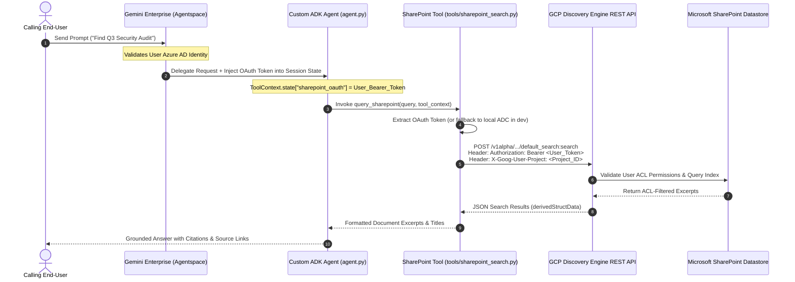

# 🔐 ADK SharePoint Knowledge Agent (Veer Muchandi ACL Pattern)

[](https://github.com/google/adk-python)
[](https://deepmind.google/technologies/gemini/)
[](https://github.com/VeerMuchandi/rad-skills)
[](https://github.com/google/alphaevolve)

A production-ready **Google Cloud Agent Development Kit (ADK 2.x)** agent that securely queries enterprise Microsoft SharePoint datastores via Google Cloud Discovery Engine.

This repository implements **Veer Muchandi's OAuth/ACL Token Propagation Pattern**, allowing custom ADK agents to inherit and enforce the calling user's native SharePoint Access Control Lists (ACLs) dynamically at query time.

---

## 🛑 The Problem: Why This Repository Exists

When building custom high-code AI agents on Google Cloud Vertex AI / Gemini Enterprise, developers encounter three major architectural blockers:

| GCP Blocker / Issue ID | Problem Description | Solution in This Repository |
| :--- | :--- | :--- |
| **The "Connector Wall"<br>`(GCP Issue #434712760)`** | Custom ADK agents on Agent Engine do not inherit no-code Agentspace connector tools automatically. | **Custom REST Search Tool**: Directly calls `discoveryengine.googleapis.com` API endpoints. |
| **`VertexAiSearchTool` Bugs<br>`(GCP Issues #483989453 & #897)`** | Built-in `VertexAiSearchTool` uses Service Account (ADC) credentials, returning empty metadata for SharePoint datastores. | **Bypasses `VertexAiSearchTool`**: Uses custom Bearer token HTTP authorization headers. |
| **ACL Security Loss** | Service account queries bypass user-level SharePoint document permissions, creating security compliance risks. | **Veer Muchandi ACL Pattern**: Extracts user Azure AD OAuth tokens from `ToolContext.state` to enforce user ACLs. |

---

## 🏗️ Architecture & Authentication Flow



---

## 📂 Directory Layout

```text
sharepoint_adk_agent/
├── README.md                  # Project documentation & execution guide
├── .gitignore                 # Python bytecode & cache exclusion rules
├── requirements.txt           # Python dependencies (google-adk, google-auth, requests)
├── agent.py                   # Core ADK RootAgent definition & modular system prompt
├── agent.yaml                 # Deployment manifest with authorizationConfig & Project Number
├── test_agent.py              # Automated 5-tier test suite
├── tools/
│   ├── __init__.py            # Tools package initializer
│   └── sharepoint_search.py   # Custom ADK tool with Veer ACL token propagation
└── ae_experiment/             # AlphaEvolve Optimization Suite
    ├── initial_program.py     # Seed program containing EVOLVE-BLOCK reranker
    ├── evaluator.py           # 3-Tier Evaluator (Validation, Verification, Evaluation)
    └── benchmark_data.json    # Search query ground-truth benchmark dataset
```

---

## 🛡️ Production Hardening Matrix

| Blindspot / Risk | Mitigation Strategy | Implementation Location |
| :--- | :--- | :--- |
| **Token Expiry (HTTP 401)** | Catches 401 status and returns a structured `AUTH_EXPIRED` signal prompting the user to refresh session. | `tools/sharepoint_search.py` & `agent.py` |
| **Non-Blocking HTTP Timeouts** | Explicit connect (`3.05s`) and read (`10s`) timeouts prevent thread pool starvation. | `tools/sharepoint_search.py` |
| **API Gateway Attribution** | Sends `X-Goog-User-Project: <project_id>` header for GCP quota and billing. | `tools/sharepoint_search.py` |
| **Multi-Schema JSON Parsing** | Multi-path extraction fallback across `derivedStructData`, `structData`, and `document.name`. | `tools/sharepoint_search.py` |
| **Reward Hacking Prevention** | AST inspection blocks forbidden modules (`sys`, `os`, `inspect`) during evaluation. | `ae_experiment/evaluator.py` |

---

## ⚙️ Environment Configuration

Set the following environment variables (or configure them in `agent.yaml`):

| Variable | Description | Example / Default |
| :--- | :--- | :--- |
| `PROJECT_ID` | GCP Project ID | `your-gcp-project-id` |
| `PROJECT_NUMBER` | GCP Project Number (*Required for authorizationConfig*) | `123456789012` |
| `LOCATION` | Discovery Engine Location | `global` |
| `COLLECTION` | Discovery Engine Collection | `default_collection` |
| `ENGINE_ID` | SharePoint Engine/Datastore Identifier | `sharepoint-search-engine` |
| `AUTH_NAME` | Session State OAuth Token Key | `sharepoint_oauth` |
| `MODEL_NAME` | Gemini Model Identifier | `gemini-2.0-flash` |

---

## 🚀 Quickstart & Verification

### 1. Installation

```bash
pip install -r requirements.txt
```

### 2. Run Automated Verification Test Suite

Run the included 5-tier test suite to verify OAuth token extraction, 401 expiry detection, timeout handling, and multi-schema parsing:

```bash
python3 test_agent.py
```

Output:
```text
==================================================
   Running Production-Hardened ADK Test Suite
==================================================

--- Test 1: Active User OAuth Token Propagation ---
✅ Test 1 PASSED: OAuth Token & X-Goog-User-Project headers sent successfully.

--- Test 2: HTTP 401 Token Expiry Handling ---
✅ Test 2 PASSED: 401 Unauthorized caught and converted to AUTH_EXPIRED signal.

--- Test 3: HTTP Timeout Exception Handling ---
✅ Test 3 PASSED: Connection timeout caught gracefully without crashing.

--- Test 4: Multi-Schema JSON Result Parsing ---
✅ Test 4 PASSED: Successfully extracted title/link from structData fallback schema.

--- Test 5: Agent Configuration & System Prompt ---
✅ Test 5 PASSED: Agent configuration and prompt rules verified.

🎉 ALL 5 PRODUCTION TESTS PASSED SUCCESSFULLY!
```

---

## 🧬 AlphaEvolve Reranker Optimization

To run the DeepMind AlphaEvolve 3-tier evaluation benchmark on search result reranking:

```bash
python3 ae_experiment/evaluator.py --program-dir ae_experiment --output-file /tmp/eval_output.json
```

Baseline Result:
```json
{
  "score": 0.8998,
  "insights": [
    { "label": "precision", "text": "100.0% (2/2)" },
    { "label": "latency_ms", "text": "0.01ms" },
    { "label": "verification", "text": "2/2 passed" }
  ]
}
```

---

## 📦 Deployment (`agent.yaml`)

Deploy using `google-agents-cli` or Vertex AI Reasoning Engine:

```yaml
name: sharepoint_knowledge_agent
display_name: "SharePoint ACL-Aware Knowledge Agent"
version: "1.0.0"
entrypoint: "agent:root_agent"

env:
  PROJECT_ID: "your-gcp-project-id"
  PROJECT_NUMBER: "123456789012"
  LOCATION: "global"
  ENGINE_ID: "sharepoint-search-engine"

authorizationConfig:
  oauthClient:
    name: "sharepoint_oauth"
    provider: "AZURE_AD"
    scopes:
      - "https://graph.microsoft.com/Files.Read.All"
      - "https://graph.microsoft.com/Sites.Read.All"

  stateInjection:
    - targetKey: "sharepoint_oauth"
      sourceClaim: "access_token"

  resource: "projects/123456789012/locations/global/authorizations/sharepoint-oauth-config"
```

To deploy via `agents-cli`:

```bash
agents-cli deploy --agent-manifest agent.yaml
```

---

## 📜 References & Acknowledgments

- **Veer Muchandi**: [ADK Gemini Enterprise Datastore Connector Specification](https://github.com/VeerMuchandi/rad-skills/blob/main/adk_ge_datastore_connector/SKILL.md)
- **Lukas Geiger**: [Vertex GenAI A2A GE OAuth Reference Architecture](https://github.com/ljogeiger/VertexGenAISamples/tree/main/public/a2a_ge_oauth_example)
- **Google ADK Framework**: [Google Agent Development Kit](https://github.com/google/adk-python)
- **DeepMind AlphaEvolve**: [AlphaEvolve Reference Guide](https://github.com/google/alphaevolve)
